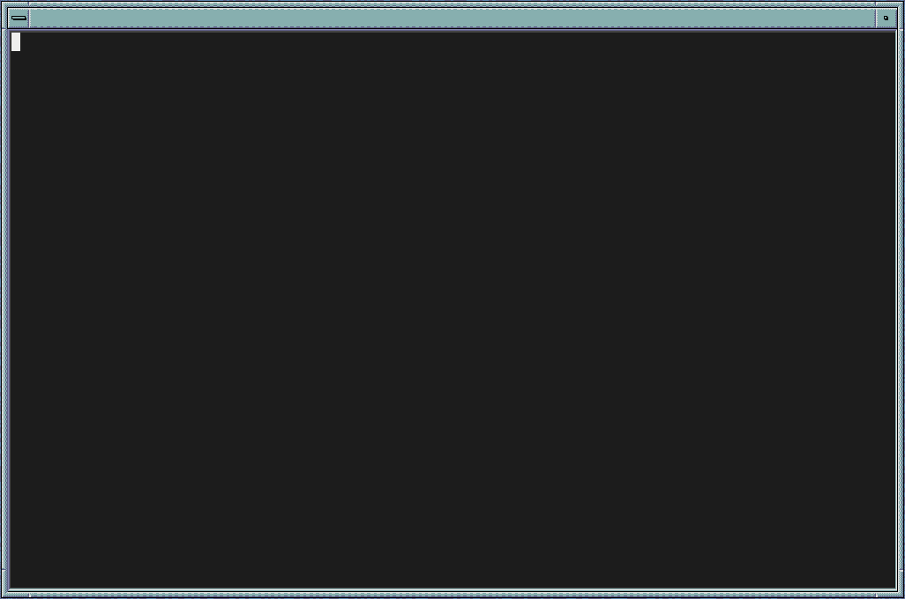
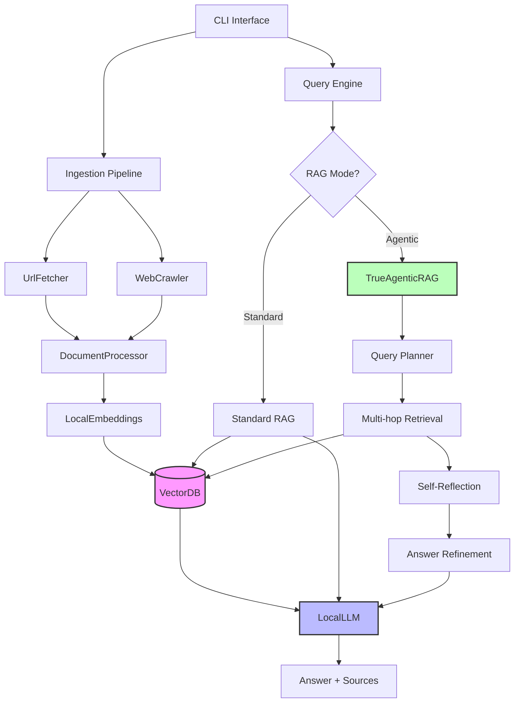

# CLI-RAG

> High-performance local RAG system with true agentic capabilities. Zero external APIs, pure .NET, runs on your hardware.

[](https://opensource.org/licenses/MIT)
[](https://dotnet.microsoft.com/)
[](https://www.kernel.org/)

A command-line tool for intelligent document search and Q&A using local LLMs. Built for engineers who want full control over their RAG pipeline without vendor lock-in or API costs.

## Demo



## Features

### Core Capabilities
- **Dual RAG Modes**: Standard retrieval or full agentic reasoning with self-reflection
- **Local LLM Inference**: Llama 3.2, Gemma 2, or any GGUF model
- **GPU Accelerated**: CUDA support with CPU fallback
- **Web Crawling**: Domain-restricted site crawling with deduplication
- **Smart Ingestion**: URL parsing with intelligent chunking
- **Optimized Vector Search**: Binary BLOB embeddings for 10x faster queries
- **Interactive Mode**: Conversational Q&A sessions
- **Zero Dependencies**: No OpenAI, no cloud services, runs offline

### Advanced Features
- **Agentic Query Planning**: LLM-driven query decomposition and refinement
- **Multi-hop Retrieval**: Iterative search with context accumulation
- **Self-Reflection Loop**: Answer quality assessment with auto-refinement
- **Reasoning Visibility**: Optional step-by-step process display
- **Duplicate Prevention**: Automatic tracking of crawled/ingested URLs
- **Batch Transactions**: Fast bulk ingestion with SQLite optimization

## Quick Start

```bash
# Clone and build
git clone https://github.com/yourusername/cli-rag.git
cd cli-rag
dotnet build -c Release

# Download a model
mkdir -p ~/.cli-rag/models
wget https://huggingface.co/bartowski/Llama-3.2-3B-Instruct-GGUF/resolve/main/Llama-3.2-3B-Instruct-Q4_K_M.gguf \
  -O ~/.cli-rag/models/Llama-3.2-3B-Instruct-Q4_K_M.gguf

# Ingest some content
./scripts/clirag.sh ingest https://en.wikipedia.org/wiki/Retrieval-augmented_generation

# Ask questions (standard mode)
./scripts/clirag.sh query

# Ask questions (agentic mode with reasoning)
./scripts/clirag.sh query --agentic --show-reasoning
```

## Installation

### Prerequisites

- **.NET 8.0 SDK** or later
- **GCC 14** (for CUDA compatibility)
- **CUDA 12.8** (optional, for GPU acceleration)

### Linux Installation

<details>
<summary>Fedora/RHEL</summary>

```bash
sudo dnf install dotnet-sdk-8.0
```
</details>

<details>
<summary>Ubuntu/Debian</summary>

```bash
wget https://packages.microsoft.com/config/ubuntu/$(lsb_release -rs)/packages-microsoft-prod.deb
sudo dpkg -i packages-microsoft-prod.deb
sudo apt-get update && sudo apt-get install -y dotnet-sdk-8.0
```
</details>

### Build

```bash
# Standard build
dotnet build -c Release

# The wrapper script sets up CUDA paths
chmod +x scripts/clirag.sh
```

## Usage

### Commands

```bash
# Ingest a single URL
./scripts/clirag.sh ingest <url>

# Crawl an entire website (stays within domain)
./scripts/clirag.sh crawl <url> [--max-pages 50]

# Interactive query mode
./scripts/clirag.sh query                    # Standard RAG
./scripts/clirag.sh query --agentic          # Agentic RAG with reflection
./scripts/clirag.sh query -a -r              # Agentic + show reasoning steps

# List all URLs by type
./scripts/clirag.sh list                     # Shows both ingested and crawled

# List only crawled websites
./scripts/clirag.sh list-crawled

# Clear database
./scripts/clirag.sh clear                    # Prompts for confirmation
./scripts/clirag.sh clear --force            # Skip confirmation
```

### Examples

**Crawl a documentation site:**
```bash
./scripts/clirag.sh crawl https://docs.example.com --max-pages 100
```

**Query with agentic reasoning:**
```bash
./scripts/clirag.sh query --agentic --show-reasoning

> What are the key differences between standard and agentic RAG?

[Step 1: Analyzing query and planning...]
[Step 2: Multi-hop retrieval...]
[Step 3: Generating initial answer...]
[Step 4: Self-reflection...]
[Step 5: Answer validated ✓]

╭─Answer─────────────────────────────────────────╮
│ Standard RAG uses simple retrieval...          │
│ Agentic RAG adds query planning, multi-hop...  │
╰────────────────────────────────────────────────╯

─ Reasoning Process ────────────────────────────
→ Query Analysis: Comparing RAG approaches...
→ Planned searches: standard RAG, agentic RAG, query planning
→ Retrieved 15 results for: 'standard RAG'
→ Retrieved 12 results for: 'agentic RAG'
→ Generated initial answer (450 chars)
→ Reflection: Answer is adequate
→ Answer validated - no refinement needed
```

## Configuration

Create `~/.cli-rag/config.json` to customize behavior:

```json
{
  "ModelPath": "~/.cli-rag/models/Llama-3.2-3B-Instruct-Q4_K_M.gguf",
  "EmbeddingModel": "all-MiniLM-L6-v2",
  "UseGpu": true,
  "GpuLayers": 33,
  "ContextSize": 4096,
  "MaxTokens": 256,
  "Temperature": 0.3,
  "TopK": 5,
  "ChunkSize": 500,
  "ChunkOverlap": 50,
  "SimilarityThreshold": 0.7
}
```

### Configuration Options

| Parameter | Default | Description |
|-----------|---------|-------------|
| `ModelPath` | `~/.cli-rag/models/...` | Path to GGUF model file |
| `EmbeddingModel` | `all-MiniLM-L6-v2` | Sentence transformer model |
| `UseGpu` | `true` | Enable CUDA acceleration |
| `GpuLayers` | `33` | Number of layers to offload to GPU |
| `ContextSize` | `4096` | LLM context window size |
| `MaxTokens` | `256` | Maximum tokens per response |
| `Temperature` | `0.3` | LLM sampling temperature (0.0-1.0) |
| `TopK` | `5` | Number of chunks to retrieve |
| `ChunkSize` | `500` | Characters per text chunk |
| `ChunkOverlap` | `50` | Overlap between chunks |
| `SimilarityThreshold` | `0.7` | Minimum cosine similarity (0.0-1.0) |

## Architecture



### Project Structure

```
cli-rag/
├── src/                      # Source code
│   ├── Agent/               # RAG implementations
│   │   ├── AgenticRAG.cs    # Standard RAG with simple query decomposition
│   │   └── TrueAgenticRAG.cs # Full agentic pipeline with reflection
│   ├── Config/
│   │   └── AppConfig.cs     # Configuration management
│   ├── Embeddings/
│   │   └── LocalEmbeddings.cs # ONNX-based sentence transformers
│   ├── Ingestion/
│   │   ├── DocumentProcessor.cs # Text chunking with overlap
│   │   ├── UrlFetcher.cs    # HTTP client + HTML parsing
│   │   └── WebCrawler.cs    # Domain-restricted web crawler
│   ├── LLM/
│   │   └── LocalLLM.cs      # LLamaSharp wrapper for GGUF models
│   ├── VectorStore/
│   │   └── VectorDb.cs      # SQLite + binary BLOB embeddings
│   └── Program.cs           # CLI entry point
├── scripts/
│   └── clirag.sh            # Wrapper script for CUDA paths
├── docs/                     # Documentation
├── assets/                   # Demo recordings
├── build/                    # Build outputs (gitignored)
└── CliRag.csproj            # Project configuration
```

## Performance

### Benchmarks (Llama 3.2 3B Q4)

| Operation | CPU (8-core) | GPU (RTX 3060) |
|-----------|--------------|----------------|
| Token Generation | ~15 tok/s | ~80 tok/s |
| Embedding (100 chunks) | ~0.5s | ~0.3s |
| Vector Search (1000 chunks) | ~50ms | ~50ms |
| Full Query (agentic) | ~8s | ~3s |

### Optimizations Applied

- **Binary BLOB embeddings**: 10x faster deserialization vs JSON
- **Batch transactions**: 50x faster bulk ingestion
- **Buffer.BlockCopy**: Direct memory operations for embeddings
- **Transaction wrapping**: Single commit for all chunks
- **Cosine similarity caching**: Pre-normalized vectors

### Resource Usage

| Model | RAM (CPU) | VRAM (GPU) | Disk Space |
|-------|-----------|------------|------------|
| Llama 3.2 1B Q4 | ~2GB | ~1GB | ~700MB |
| Llama 3.2 3B Q4 | ~3GB | ~2GB | ~1.7GB |
| Gemma 2 2B Q5 | ~2.5GB | ~1.5GB | ~1.5GB |

Database grows ~2KB per chunk (text + embedding).

## Technical Details

### Vector Search Strategy

1. **Query Embedding**: ONNX runtime with `all-MiniLM-L6-v2` (384 dimensions)
2. **Storage**: Binary BLOB format in SQLite
3. **Retrieval**: In-memory cosine similarity (all vectors loaded)
4. **Fallback**: Keyword search if embeddings unavailable

> **Note**: For >10k chunks, consider migrating to Qdrant or Milvus for approximate nearest neighbor search.

### Agentic RAG Pipeline

```
User Query
    ↓
[1] LLM analyzes query → generates 2-3 search queries
    ↓
[2] Multi-hop retrieval → fetch results for each query → deduplicate
    ↓
[3] LLM generates initial answer from top-K chunks
    ↓
[4] LLM reflects: "Is this answer adequate?"
    ↓
[5a] If adequate → return answer
[5b] If inadequate → additional retrieval → regenerate answer
    ↓
Return final answer + reasoning steps
```

### Prompt Engineering

The system uses Llama 3.2 chat format:
```
<|start_header_id|>system<|end_header_id|>
{system_prompt}<|eot_id|>
<|start_header_id|>user<|end_header_id|>
{user_prompt}<|eot_id|>
<|start_header_id|>assistant<|end_header_id|>
```

Anti-prompts: `<|eot_id|>`, `</s>`, `<|end_of_text|>`

## Recommended Models

### Llama 3.2 Series
- **1B Instruct**: Ultra-fast, basic comprehension
- **3B Instruct** ⭐: Best balance (recommended)

### Gemma 2 Series
- **2B IT**: Compact, good quality
- **9B IT**: Higher quality, slower

### Download Links

```bash
# Llama 3.2 3B Q4 (1.7GB) - Recommended
wget https://huggingface.co/bartowski/Llama-3.2-3B-Instruct-GGUF/resolve/main/Llama-3.2-3B-Instruct-Q4_K_M.gguf

# Gemma 2 2B Q5 (1.5GB) - Alternative
wget https://huggingface.co/bartowski/gemma-2-2b-it-GGUF/resolve/main/gemma-2-2b-it-Q5_K_M.gguf
```

Place models in `~/.cli-rag/models/`

## Troubleshooting

### GPU Not Detected

```bash
# Check CUDA installation
nvidia-smi

# Verify library paths
ldd ./build/bin/Release/net8.0/CliRag | grep cuda

# Use the wrapper script (sets LD_LIBRARY_PATH)
./scripts/clirag.sh query
```

### Out of Memory

Reduce `GpuLayers` in config or use smaller quantization (Q4 vs Q5).

### Slow Queries

- Check database size: `du -h ~/.cli-rag/vectors.db`
- For >5000 chunks, consider clearing old data
- Lower `TopK` to retrieve fewer chunks

### Model Load Errors

Ensure model path in config matches downloaded file:
```bash
ls -lh ~/.cli-rag/models/
```

## Database Location

All data stored in `~/.cli-rag/`:
- `vectors.db` - Document chunks and embeddings
- `config.json` - User configuration
- `models/` - Downloaded GGUF models

## Contributing

Built with a focus on performance and simplicity. Pull requests welcome for:
- Additional embedding models
- Query optimization strategies
- New document parsers (PDF, etc.)
- Alternative vector stores

## License

MIT License - see LICENSE file for details.

---

**Built for engineers who value privacy, performance, and local control over their AI infrastructure.**
